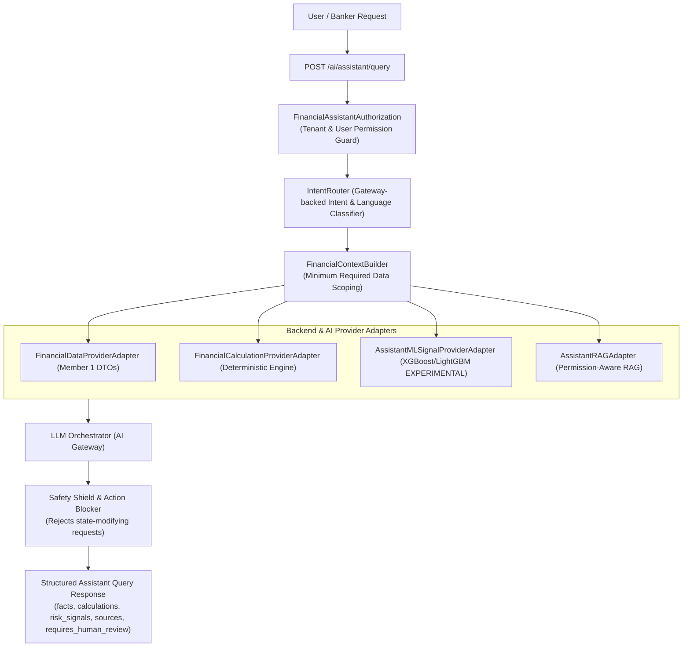

# Financial Intelligence Assistant Architecture - AgentTrust OS

**Author**: Member 3 (AI/ML/LLM/Agent Intelligence Subsystem Lead)  
**Date**: August 25, 2026  
**Scope**: Phase 3 Financial Intelligence Assistant Orchestration Layer

---

## High-Level Architecture Flow

---

## Core Orchestration Principles

1. **LLM Non-Authoritative Principle**: The LLM is **NEVER** the source of truth for financial numbers, loan approvals, transfers, or repayment alterations. Financial values (`₹5,00,000`, `12.5%`, `94/100`) are computed by backend deterministic engines and preserved exactly without LLM hallucination or arithmetic.
2. **5 Financial Use Cases Supported**:
   - **Loan Affordability** ("Can I afford a ₹5 lakh loan?")
   - **Repayment Query** ("How much do I have to repay next month?")
   - **Financial Health Explanation** ("Why did my financial health score decrease?")
   - **Loan Scenario Simulation** ("What happens if I take a ₹5 lakh loan for 3 years?")
   - **Applicant Risk Explanation** ("Why is this applicant considered high risk?")
3. **Minimum Required Data Scoping**: Context builder fetches only the minimum data required for the specific intent rather than pulling unnecessary customer profile details.
4. **Action-Blocking Safety Shield**: Requests to approve loans, transfer funds, or modify repayments are blocked before execution, returning `requires_human_review = True` and directing the user to authorized banking workflows.
5. **Fact / Inference Separation**: Structured outputs explicitly separate `FACTS`, `CALCULATIONS`, `MODEL_SIGNALS`, `POLICY_EVIDENCE`, and `AI_INFERENCE`.
