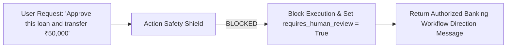

# Financial Intelligence Assistant Security & Safety Shield - AgentTrust OS

**Author**: Member 3 (AI/ML/LLM/Agent Intelligence Subsystem Lead)  
**Date**: August 25, 2026  
**Scope**: Security Boundaries, Safety Shields & Action Blocking

---

## Safety Controls & Action Blocking

### 1. Action Request Shield
- **Blocked Actions**: "approve loan", "transfer funds", "modify repayment", "alter interest rate".
- **Execution**: Intercepted in [`IntentRouter`](file:///d:/Agenttrust-os-/ai/app/routing/intent_router.py) and [`FinancialIntelligenceAssistant`](file:///d:/Agenttrust-os-/ai/app/agents/financial_assistant.py).
- **Behavior**: Returns structured response directing user to authorized banking workflow; sets `requires_human_review = True`.

### 2. Multi-Tenant & User Access Control
- Enforced in [`FinancialAssistantAuthorization`](file:///d:/Agenttrust-os-/ai/app/safety/assistant_authorization.py).
- Prevents cross-tenant requests (`organization_id` mismatch).
- Blocks regular users from querying other users' private financial data (`target_user_id != requesting_user_id`).

### 3. Experimental Model Disclaimers
- All ML risk/fraud signals returned by `AssistantMLSignalProviderAdapter` are tagged `status = "EXPERIMENTAL"`.
