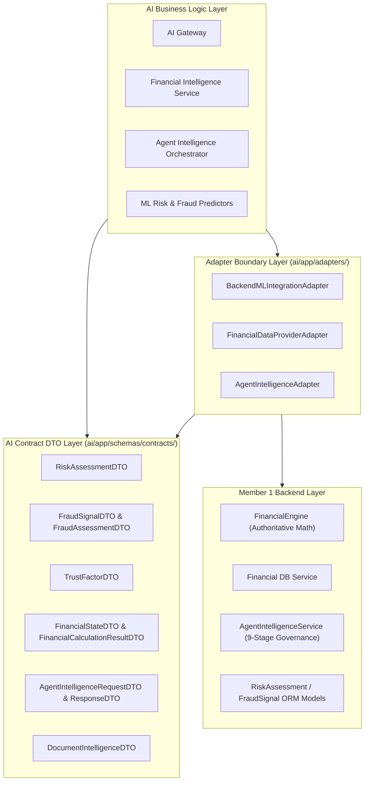

# AI Subsystem Contract Architecture - AgentTrust OS

**Author**: Member 3 (AI/ML/LLM/Agent Intelligence Subsystem Lead)  
**Date**: August 25, 2026  
**Scope**: Phase 1 Architectural Decoupling Documentation

---

## Architectural Principles & Dependency Inversion

---

## System Authority Matrix

| Domain | Authoritative Subsystem | AI Subsystem Role | Boundary Interface |
| :--- | :--- | :--- | :--- |
| **Financial Calculations (EMI, Amortization, FOIR)** | **Member 1 Backend (`FinancialEngine`)** | Query understanding, multi-lingual explanation, structured output synthesis, exact figures retention. | `FinancialDataProviderAdapter` (`FinancialCalculationResultDTO`) |
| **Account Balances & Transactions** | **Member 1 Backend (`FinancialService`)** | User financial state consumer. | `FinancialDataProviderAdapter` (`FinancialStateDTO`) |
| **Agent Governance & Policy Enforcement** | **Member 1 Backend (`AgentIntelligenceService`)** | Agent tool call execution & governance check request. | `AgentIntelligenceAdapter` (`AgentIntelligenceResponseDTO`) |
| **Model Predictions & Feature Attributions** | **Member 3 AI Subsystem** | Feature preprocessing, ML inference, calibration, SHAP attributions. | `BackendMLIntegrationAdapter` (`RiskAssessmentDTO`, `FraudSignalDTO`) |

---

## Security & Multi-Tenant Boundaries

- **Tenant Isolation Context**:
  Every Contract DTO (`FinancialStateDTO`, `AgentIntelligenceRequestDTO`, `DocumentIntelligenceDTO`) explicitly carries `organization_id` and `user_id` context fields.
- **Authorization Context**:
  Adapters guarantee that database queries and calculations are strictly scoped to the requesting user and tenant boundary.
- **Non-Authoritative AI Output Rules**:
  Underwritten risk decisions or financial figures generated by LLMs are cross-checked against backend authoritative DTOs. Mismatched figures or unapproved underwriting proposals require mandatory `HUMAN_REVIEW`.

---

## Decoupling Summary

1. Member 1's backend can modify ORM schemas or database tables without breaking Member 3's AI business logic.
2. Member 3's AI domain logic depends solely on Pydantic Contract DTOs in `ai/app/schemas/contracts/`.
3. Backend ORM models (`RiskAssessment`, `FraudSignal`, `TrustFactor`) and backend internal services (`FinancialEngine`, `AgentIntelligenceService`) are imported **exclusively inside `ai/app/adapters/`**.
