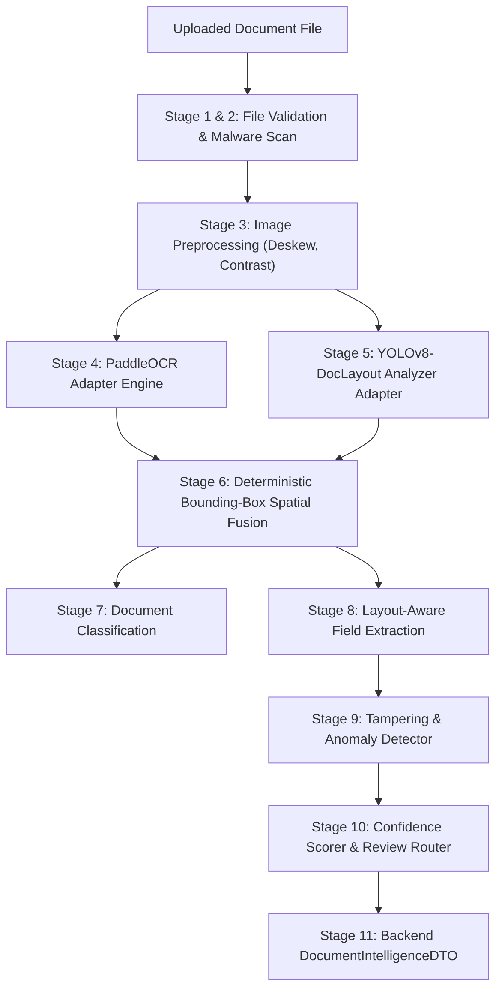

# AI Document Perception Architecture - AgentTrust OS

**Author**: Member 3 (AI/ML/LLM/Agent Intelligence Subsystem Lead)  
**Date**: August 25, 2026  
**Scope**: Phase 2A Production Document Perception Pipeline

---

## 11-Stage Pipeline Architecture



---

## Component Deep Dive

### 1. Production PaddleOCR Adapter Engine ([`PaddleOCREngine`](file:///d:/Agenttrust-os-/ai/app/perception/ocr_engine.py))
- **Singleton Lifecycle**: Models are initialized once and cached via `model_registry_manager` to prevent per-request reloading overhead.
- **Real Inference**: Performs full PaddleOCR line & 2D bounding box `[x1, y1, x2, y2]` extraction when PaddleOCR runtime is installed.
- **Graceful Unavailability Status**: Returns explicit `PerceptionStatus.MODEL_UNAVAILABLE` when dependencies or weights are missing, extracting readable text streams without fabricating hardcoded fake lines or crashing the application.

### 2. Production YOLO Layout Analyzer Adapter ([`YOLOLayoutAnalyzer`](file:///d:/Agenttrust-os-/ai/app/perception/layout.py))
- **Ultralytics Framework**: Loads trained document-layout model artifacts from `YOLO_MODEL_PATH`.
- **Configurable Artifact Management**: Model path, device (`cpu`/`cuda`), confidence threshold, IoU threshold, and image size are controlled via environment variables.
- **Explicit Artifact Status**: If `YOLO_MODEL_PATH` is unconfigured or artifact file is missing, returns status `MODEL_UNAVAILABLE` and an empty layout list. **Never fabricates fake detections or static bounding boxes.**

### 3. Deterministic Spatial Document Fusion ([`DocumentFusionEngine`](file:///d:/Agenttrust-os-/ai/app/perception/fusion.py))
- **Geometric Bounding-Box Overlap**: Calculates 2D spatial containment ratio $\frac{\text{Intersection Area}}{\text{OCR Area}} \ge 0.40$ to associate OCR text lines with YOLO structural layout elements (Header, Table, Logo, Stamp, Signature).
- **Zero LLM Overhead**: Uses deterministic spatial math rather than expensive LLMs.

### 4. Structured Error & Status Handling
Returns explicit status codes:
- `SUCCESS`: Complete document perception succeeded.
- `MODEL_UNAVAILABLE`: Model artifact or runtime dependency is unconfigured/missing.
- `INVALID_DOCUMENT`: File size (>15MB), format, or signature validation failed.
- `OCR_FAILURE`: Image parsing or OCR execution error.
- `LAYOUT_FAILURE`: YOLO bounding box inference error.
- `TIMEOUT` / `RESOURCE_ERROR`: Execution limit exceeded.

---

## Configuration Reference

Set in `ai/app/core/config.py` (via `.env`):
- `OCR_PROVIDER`: `paddleocr`
- `OCR_MODEL`: `ch_PP-OCRv4_rec`
- `OCR_USE_ANGLE_CLS`: `true`
- `YOLO_MODEL_PATH`: Path to trained `.pt` model file (e.g. `/models/yolov8_doclayout.pt`)
- `YOLO_CONFIDENCE_THRESHOLD`: `0.25`
- `YOLO_IOU_THRESHOLD`: `0.45`
- `YOLO_DEVICE`: `cpu` or `cuda`
- `DOCUMENT_MAX_SIZE`: `15728640` (15 MB)

---

## How to Provide a Trained YOLO Document-Layout Artifact

1. Place your trained PyTorch model file (e.g. `yolov8x_doclayout.pt`) in `ai/models/` or a secure local path.
2. Set the environment variable:
   ```bash
   export YOLO_MODEL_PATH="d:/Agenttrust-os-/ai/models/yolov8x_doclayout.pt"
   ```
3. Restart the service. `YOLOLayoutAnalyzer` will automatically detect the artifact, verify file checksum, load it into `model_registry_manager`, and report status `MODEL-READY`.
