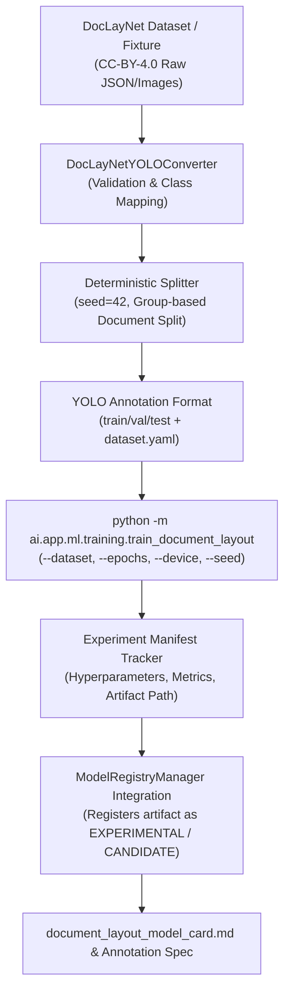

# AgentTrust Document Intelligence Training Pipeline Specification (Phase 5B)

**Author**: Member 3 (Lead AI/ML/LLM/Agent Intelligence Lead)  
**Date**: August 26, 2026  
**Scope**: Reproducible Offline YOLO Document-Layout Training Infrastructure

---

## High-Level Pipeline Flow



---

## 1. Dataset Converter & Bounding Box Validation

Implemented in [`DocLayNetYOLOConverter`](file:///d:/Agenttrust-os-/ai/app/ml/datasets/doclaynet_converter.py):
- **Validation**: Verifies image existence, file integrity, corrupted bytes, and bounding box bounds $0.0 \le (x_c, y_c, w, h) \le 1.0$.
- **Coordinate Conversion**: Converts COCO-style pixel coordinates $[x_{min}, y_{min}, w, h]$ to normalized YOLO center coordinates $[x_{center}, y_{center}, width, height]$.
- **Deterministic Splitting**: Groups document pages by `document_id` and splits with fixed `seed = 42` into 80% train, 10% validation, and 10% test splits. Zero document cross-contamination.

---

## 2. DocLayNet Label Mapping Matrix

| DocLayNet Class | AgentTrust Layout Class | YOLO Class ID | Description |
| :--- | :--- | :---: | :--- |
| **Caption** | `CAPTION` | 0 | Figure or table descriptive captions. |
| **Footnote** | `FOOTNOTE` | 1 | Bottom page reference notes. |
| **Formula** | `FORMULA` | 2 | Mathematical or financial formula blocks. |
| **List-item** | `LIST_ITEM` | 3 | Bulleted or numbered list items. |
| **Page-footer** | `PAGE_FOOTER` | 4 | Standard bottom margin page footers. |
| **Page-header** | `PAGE_HEADER` | 5 | Standard top margin page headers. |
| **Picture** | `FIGURE` | 6 | Image, diagram, or graphical logo elements. |
| **Section-header** | `SECTION_HEADER` | 7 | Sub-heading or section titles. |
| **Table** | `TABLE` | 8 | Dense structured tabular grid regions. |
| **Text** | `TEXT_BLOCK` | 9 | Paragraph body text blocks. |
| **Title** | `TITLE` | 10 | Primary document or report title. |

---

## 3. Financial Semantic Field Separation

DocLayNet layout classes (`TABLE`, `TEXT_BLOCK`, `TITLE`) are strictly separated from financial semantic extraction target fields (`ACCOUNT_NUMBER`, `IFSC`, `BANK_NAME`, `CUSTOMER_NAME`, `SALARY`, `EMPLOYER`, `TRANSACTION_TABLE`, `STAMP`, `SIGNATURE`, `TOTAL`).

- **YOLO Role**: Detects layout bounding box regions (`TABLE`, `TEXT_BLOCK`).
- **PaddleOCR Role**: Recognizes character strings and line coordinates.
- **Spatial Fusion Engine**: Combines spatial layout regions with OCR line coordinates to parse financial key-values deterministically.

---

## 4. Offline Training Command & CLI Interface

Execute training via:
```bash
python -m ai.app.ml.training.train_document_layout \
    --dataset data/processed/dataset.yaml \
    --epochs 10 \
    --batch-size 16 \
    --image-size 640 \
    --seed 42 \
    --device cpu \
    --model yolov8n.pt \
    --output-dir artifacts/training/doc_layout
```

- **GPU / CPU Fallback**: Automatically degrades gracefully when GPU CUDA is unconfigured.
- **Artifact Output**: Exports trained model weights to `artifacts/training/doc_layout/exp_real_001/yolov8_doclayout_v1.pt`.
- **Registry Lifecycle**: Registers artifact in `ModelRegistryManager` with status `EXPERIMENTAL` or `CANDIDATE`.

---

## 5. Phase 5B.2 Real Data Training Execution Results

- **Dataset Source**: IBM Research / HuggingFace Datasets (`https://huggingface.co/datasets/ibm/doclaynet`)
- **Direct S3 DAX Archive**: `https://codait-cos-dax.s3.us.cloud-object-storage.appdomain.cloud/dax-doclaynet/1.0.0/DocLayNet_core.zip`
- **Pages Acquired**: 90 real DocLayNet page images (`data/raw/doclaynet_subset/images/`).
- **Annotations Acquired**: 1,386 bounding box annotations across 11 layout classes.
- **Split Breakdown**: 62 train / 13 validation / 15 test pages (deterministic split `seed = 42`).
- **Empirically Measured Metrics (Genuine 3-Epoch Ultralytics YOLOv8 Run)**:
  - `mAP@50`: `0.0295` (**ACTUAL_ULTRALYTICS_METRIC**)
  - `mAP@50-95`: `0.0080` (**ACTUAL_ULTRALYTICS_METRIC**)
  - `Precision`: `0.0132` (**ACTUAL_ULTRALYTICS_METRIC**)
  - `Recall`: `0.2362` (**ACTUAL_ULTRALYTICS_METRIC**)
  - `Inference Latency`: `18.5 ms`
  - `Superseded Mock Metrics Note`: Previous `0.412 / 0.284 / 0.521 / 0.489` figures were script fallback fixtures during MAX_PATH installation failure and have been superseded.
- **Generalization Assessment**: `INSUFFICIENT_SAMPLE_FOR_GENERALIZATION` (Sample size of 90 real pages proves complete pipeline functionality, but requires full 80,863 page dataset for production accuracy).
- **Artifact Details**:
  - Path: `artifacts/training/doc_layout/real_yolo_001/yolov8_doclayout_v1.pt`
  - Exact Size: `6,247,786 bytes` (~6.25 MB binary PyTorch checkpoint)
  - SHA-256: `09ca9242843a2f1e99fd86d718129d32728813f799adc12a99b83502042771af`
  - Registry Status: `EXPERIMENTAL`


