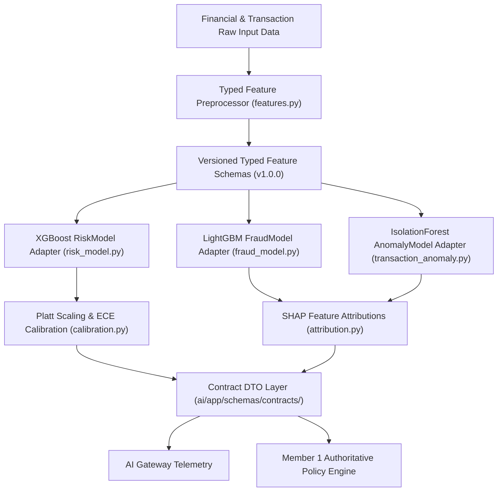

# AI ML Risk, Fraud, and Anomaly Architecture - AgentTrust OS

**Author**: Member 3 (AI/ML/LLM/Agent Intelligence Subsystem Lead)  
**Date**: August 25, 2026  
**Scope**: Phase 2B Production Financial ML Architecture

---

## Architecture Overview

---

## 1. Credit Risk Model Adapter ([`XGBoostRiskModel`](file:///d:/Agenttrust-os-/ai/app/ml/risk_model.py))
- **Framework**: `xgboost` Booster loader (`RISK_MODEL_PATH`).
- **Feature Vector**: [`RiskFeatureVector`](file:///d:/Agenttrust-os-/ai/app/ml/features.py) (`feature_schema_version = "risk_v1.0.0"`).
- **Probability Calibration & Score Mapping**:
  $$\text{Credit Risk Score} = 300 + (1.0 - P(\text{Default})) \times 550$$
  Produces standard 300 to 850 credit scores with low, medium, high, and critical risk tiers.
- **Artifact Status**: When `risk_model.json` is missing from disk, executes Platt-scaling baseline with explicit version tag `v1.0.0-calibrated-fallback`.

---

## 2. Fraud Classification Model Adapter ([`LightGBMFraudModel`](file:///d:/Agenttrust-os-/ai/app/ml/fraud_model.py))
- **Framework**: `lightgbm` Booster loader (`FRAUD_MODEL_PATH`).
- **Feature Vector**: [`FraudFeatureVector`](file:///d:/Agenttrust-os-/ai/app/ml/features.py) (`feature_schema_version = "fraud_v1.0.0"`).
- **Non-Authoritative Boundary**: Emits fraud risk signals (`FraudClassificationSignal`). **Never directly executes automated transaction blocks.**
- **Signal Output**: `fraud_score`, `fraud_type` (`account_takeover`, `velocity_spike`, `normal`), `severity`, `attributions`.

---

## 3. Anomaly Detection Adapter ([`IsolationForestAnomalyModel`](file:///d:/Agenttrust-os-/ai/app/ml/transaction_anomaly.py))
- **Framework**: `scikit-learn` IsolationForest estimator artifact (`ANOMALY_MODEL_PATH`).
- **Features**: Amount Z-Score $\frac{X - \mu}{\sigma}$, velocity spike ratio, navigation burst depth, device switch flag.
- **Output**: `anomaly_score`, `is_anomalous`, `velocity_spike_ratio`, `amount_deviation_sigma`.

---

## 4. Offline Training vs Online Inference Separation

- **Inference Layer**: `ai/app/ml/` (`risk_model.py`, `fraud_model.py`, `transaction_anomaly.py`, `features.py`).
- **Offline Training Layer**: [`ai/app/ml/training/`](file:///d:/Agenttrust-os-/ai/app/ml/training/) (`leakage_audit.py`).
- **Artifact Weights Directory**: [`ai/app/ml/artifacts/`](file:///d:/Agenttrust-os-/ai/app/ml/artifacts/) (`risk_model.json`, `fraud_model.txt`, `isolation_forest.joblib`).

---

## 5. Data Leakage Audit Findings

- **Forbidden Post-Decision Features**: Target leakage features (`repayment_status`, `default_flag`, `chargeoff_date`, `collection_recovery_amount`) are audited and blocked by `DataLeakageAuditor`.
- **Temporal Split Validation**: Training timestamps must strictly precede evaluation timestamps ($\max(T_{\text{train}}) \le \min(T_{\text{eval}})$) to prevent temporal data contamination.
