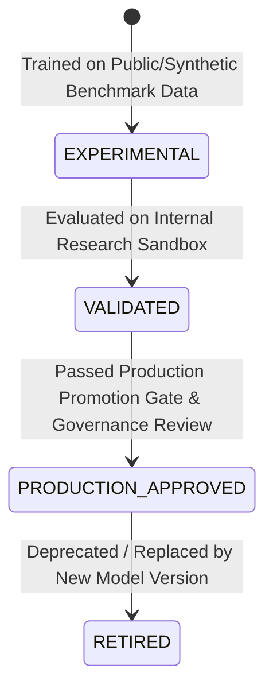

# AI Model Lifecycle & Governance Matrix - AgentTrust OS

**Author**: Member 3 (AI/ML/LLM/Agent Intelligence Subsystem Lead)  
**Date**: August 25, 2026  
**Scope**: Model Lifecycle Statuses & Governance Controls

---

## Model Lifecycle Statuses

| Lifecycle Status | Description | Production Decisioning Authorized? |
| :--- | :--- | :--- |
| **`EXPERIMENTAL`** | Trained on public datasets (UCI Credit, IBM AML). Used strictly for benchmarking. | ❌ **NO** |
| **`VALIDATED`** | Validated on internal research sandbox datasets. | ❌ **NO** |
| **`PRODUCTION_APPROVED`** | Passed production evaluation thresholds and regulatory compliance audit. | ❌ **NO** *(Member 1 backend remains sole authoritative decision maker)* |
| **`RETIRED`** | Deprecated model version. | ❌ **NO** |

---

## Governance Rules

1. **All Benchmark Models are `EXPERIMENTAL`**: Models trained on public datasets default strictly to status `EXPERIMENTAL`.
2. **Non-Authoritative Boundary**: AI models produce risk signals, probabilities, and reason codes. Member 1's backend policy system remains the sole authoritative financial decision-maker.
