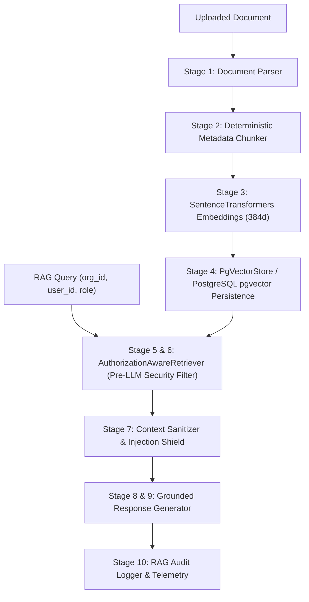

# AI RAG Architecture - AgentTrust OS

**Author**: Member 3 (AI/ML/LLM/Agent Intelligence Subsystem Lead)  
**Date**: August 25, 2026  
**Scope**: Phase 2C Production Permission-Aware Knowledge Layer

---

## 10-Stage Permission-Aware Pipeline Architecture

---

## Component Deep Dive

### 1. Real Embedding Provider Adapter ([`SentenceTransformersEmbeddingProvider`](file:///d:/Agenttrust-os-/ai/app/rag/embedding.py))
- **Framework**: `sentence-transformers/all-MiniLM-L6-v2` (384-dimensional dense vectors).
- **Singleton Lifecycle**: Cached in `model_registry_manager` to prevent per-request reloading overhead.
- **Zero Pseudo-Sine Fallback**: If dependencies or model weights are missing, returns explicit status `MODEL_UNAVAILABLE` without generating pseudo-sine or fake deterministic vectors.

### 2. Persistent Vector Store Abstraction ([`PgVectorStore`](file:///d:/Agenttrust-os-/ai/app/rag/vector_store.py))
- **Database Engine**: PostgreSQL + `pgvector` extension interface.
- **Hard Tenant Isolation**: Enforces `WHERE organization_id = %s` at database query layer.
- **Persistence Across Restarts**: Saves indexed document chunks to disk persistence (`data/vector_store_chunks.json`) across application restarts.
- **Status Reporting**: Reports status `PGVECTOR_REQUIRED` when `pgvector` is unconfigured.

### 3. Pre-LLM Authorization Retriever ([`AuthorizationAwareRetriever`](file:///d:/Agenttrust-os-/ai/app/rag/retriever.py))
- Enforces 7 security filters **BEFORE** LLM context assembly:
  1. Multi-tenant isolation (`organization_id`)
  2. Non-deletion state (`is_deleted == False`)
  3. Active policy version state (`is_active_version == True`)
  4. Consent state (`consent_given == True`)
  5. Role-based access control (`role in allowed_roles`)
  6. Sensitivity privileges (`restricted` sensitivity requires `banker` role)
  7. User isolation (`user_id` scoping)
- **Critical Security Rule**: Unauthorized document context (e.g. Org B document requested by Org A user) is strictly blocked before reaching LLM prompt context.

### 4. Grounded Response & Hallucination Control ([`RAGGenerator`](file:///d:/Agenttrust-os-/ai/app/rag/generator.py))
- Evaluates similarity score against `RAG_SIMILARITY_THRESHOLD`.
- Returns explicit grounding status (`GROUNDED`, `PARTIALLY_GROUNDED`, `INSUFFICIENT_EVIDENCE`).
- Returns `INSUFFICIENT_EVIDENCE` status without hallucinating when evidence is absent or similarity is below threshold.
