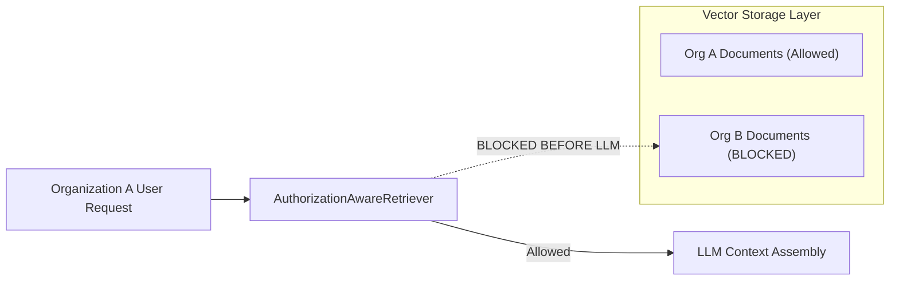

# AI RAG Security & Multi-Tenant Isolation - AgentTrust OS

**Author**: Member 3 (AI/ML/LLM/Agent Intelligence Subsystem Lead)  
**Date**: August 25, 2026  
**Scope**: Security Boundaries, Tenant Isolation, & Data Protection

---

## Security Architecture & Verification

---

## Core Security Controls

1. **Pre-LLM Tenant Isolation**: Vector search and filtering enforce hard tenant boundaries at database query time (`WHERE organization_id = %s`).
2. **Zero Cross-Tenant Leakage**: Tested via `test_8_critical_security_org_a_user_never_receives_org_b_document_context`. Org B document snippets are strictly prevented from entering Org A LLM context.
3. **Document Deletion Propagation**: Deleting a document (`delete_document`) deactivates associated chunks and removes embeddings from vector search.
4. **Active Version Scoping**: Outdated policy versions (`is_active_version = False`) are filtered prior to context assembly.
5. **PII Protection & Redacted Audit Logging**: SHA-256 query hashes (`query_hash`) are recorded in `RAGAuditLogger`. Raw PII document contents (PAN, Aadhaar, account numbers) are redacted from logs.
