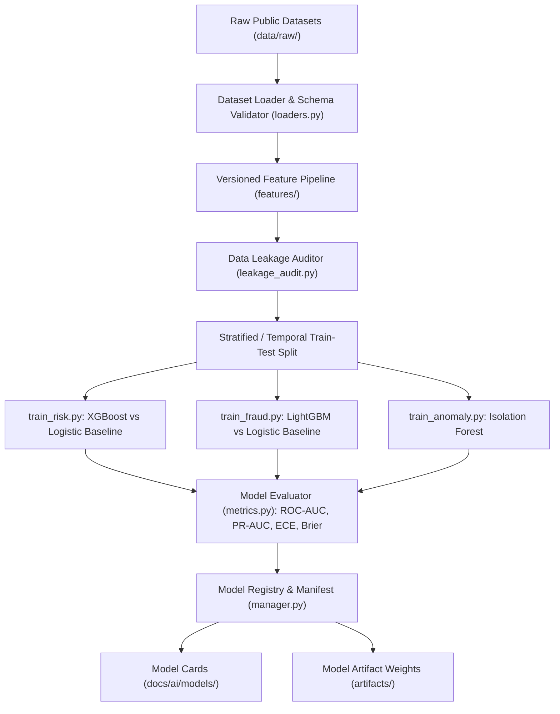

# AI ML Training Architecture - AgentTrust OS

**Author**: Member 3 (AI/ML/LLM/Agent Intelligence Subsystem Lead)  
**Date**: August 25, 2026  
**Scope**: Reproducible Offline Training Infrastructure

---

## Offline Training Architecture



---

## Directory Organization

```text
ai/app/ml/
├── datasets/
│   ├── registry.py        # Dataset Metadata Registry
│   ├── loaders.py         # Schema-validated Ingestion Loaders
│   └── __init__.py
├── training/
│   ├── train_risk.py      # Offline Credit Risk XGBoost CLI Pipeline
│   ├── train_fraud.py     # Offline Synthetic AML LightGBM CLI Pipeline
│   ├── train_anomaly.py   # Offline Isolation Forest Anomaly CLI Pipeline
│   └── leakage_audit.py   # Target & Temporal Data Leakage Auditor
├── registry/
│   ├── manager.py         # Model Manifest & Artifact Registry
│   └── __init__.py
├── evaluation/
│   └── metrics.py         # ROC-AUC, PR-AUC, Brier score, ECE Calibration Error
├── features/
│   ├── credit_pipeline.py # credit_features_v1.0.0
│   └── aml_pipeline.py    # aml_features_v1.0.0
├── artifacts/             # Model Weight Artifacts
└── inference/             # Production Inference Adapters
```

---

## Key Principles

1. **Offline CLI Command Execution**: Model training is executed strictly offline via CLI commands (`python -m ai.app.ml.training.train_risk`). Models are NEVER trained inside FastAPI request handlers.
2. **Baseline Model Comparisons**: Candidates (XGBoost / LightGBM) are evaluated against simple Logistic Regression baselines to verify that model complexity yields legitimate metric improvements.
3. **Data Privacy & Separated Root**: Raw dataset files are stored in `data/raw/` (ignored by `.gitignore`).
